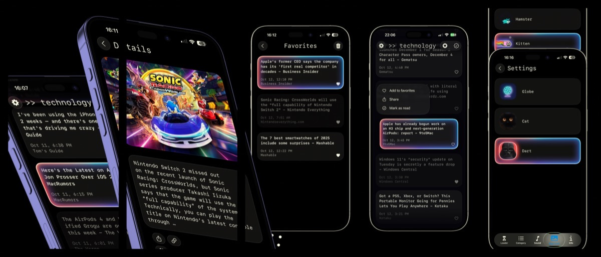
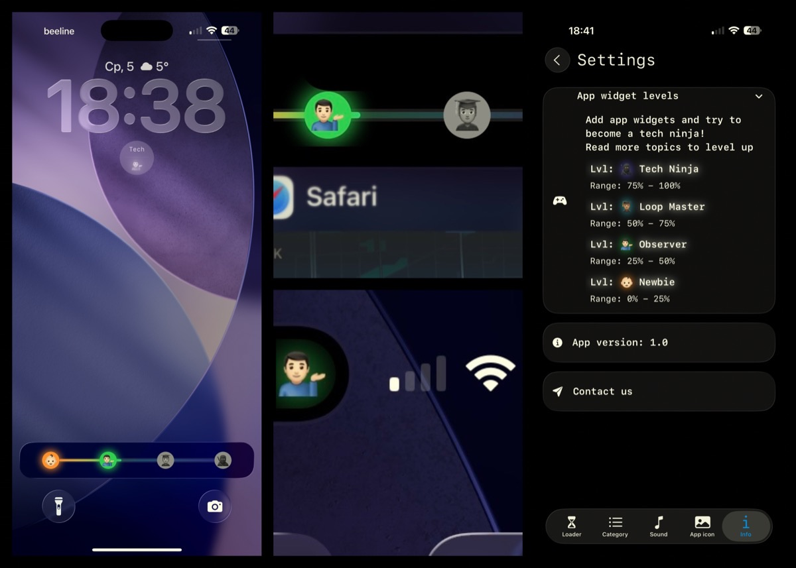

# 📰 News

[](https://developer.apple.com/ios/)
[](https://swift.org)
[](https://developer.apple.com/xcode/swiftui/)
[](https://developer.apple.com/documentation/swiftdata)
[](https://developer.apple.com/documentation/activitykit)
[](https://developer.apple.com/metal/)
[](https://developer.apple.com/documentation/testing)




**News** is a full-featured, high-performance iOS news application built with modern SwiftUI, SwiftData, Combine, Metal Shaders, and ActivityKit. Designed with a custom glassmorphism design system, instant runtime multi-language localization, and comprehensive Unit and UI test coverage.

---

## 🔥 Features & Highlights

- **🌍 Zero-Restart Dynamic Localization**: Instant runtime language switching (**English 🇬🇧, Russian 🇷🇺, Indonesian 🇮🇩**) directly in settings without restarting the app, powered by **SwiftGen** (`Texts.currentLanguage`) and **SwiftData**.
- **🧪 Full Automated Test Suite**:
  - **Unit Testing**: Powered by Swift Testing (`import Testing` `@Test`) for ViewModels (`MainViewModel`, `SettingsViewModel`), `SettingsManager`, reactive Combine pipelines, models, extensions, and localization logic.
  - **UI Testing**: Automated `XCTest UI` suite (`NewsUITests`) covering navigation flows, settings tabs, favorites, toolbar actions, and scroll interactions.
- **🎨 Metal Shaders**: Custom Metal shader library (`Shaders.metal`) powering real-time shader visual effects (`ShaderLibrary.complexWave`).
- **🌐 WebKit Reader with Dual Progress Lines**: `WKWebView` featuring **KVO estimated progress line** (`publisher(for: \.estimatedProgress)`) and **scroll progress line** (`UIScrollViewDelegate` scroll ratio).
- **📋 Rich Context Menus**: Contextual menus (`.contextMenu`) across cells for quick actions (*Add/Remove Favorites*, *Share*, *Mark as Read/Unread*, *Copy Link*).
- **📱 Home Screen Quick Actions (Fastactions)**: 3D Touch / Home Screen shortcuts (`UIApplicationShortcutItem`) launching directly into *Settings* or *Share*.
- **🏝️ Live Activities & Gamification**: Real-time Lock Screen & Dynamic Island tracking via **ActivityKit**, gamifying user reading progress (*Newbie ➔ Curious Observer ➔ Loop Master ➔ Tech Ninja*).
- **🖼️ Async Cached Image**: High-performance `CachedAsyncImage` pipeline for smooth image loading and memory/disk caching.
- **🔔 Local Notifications**: Scheduled local notifications via `UNUserNotificationCenter` (`UNCalendarNotificationTrigger`) with custom audio themes.
- **🧹 SwiftLint Integration**: Automated code quality enforcement built directly into the Xcode Build Phase.
- **📌 Offline Favorites & Storage**: SwiftData persistence for offline article reading and read/unread status tracking.
- **🎨 Glassmorphism & Media Personalization**: Custom glassmorphic UI (`.glassCard()`), 5 Lottie loaders (Rocket 🚀, Hourglass ⏳, Astronaut 👩‍🚀, Hamster 🐹, Kitten 🐱), 3 audio themes (*Star Wars*, *Cats*, *Silent*), alternate app icons, and haptics.
- **🧩 WidgetKit Widgets**: Static & dynamic Home Screen widgets sharing state via App Groups (`group.news2.0.News`).

---

## 🛠️ Tech Stack

| Component | Technology |
| :--- | :--- |
| **Architecture** | MVVM + Protocol-Oriented Programming (POP) + `ModuleBuilder` DI |
| **UI Framework** | SwiftUI + UIKit Interoperability (`WKWebView`, `UIActivityViewController`) |
| **Shaders** | Metal (`Shaders.metal`, `ShaderLibrary`) |
| **Persistence** | SwiftData with shared App Group container (`group.news2.0.News`) |
| **Reactivity** | Combine (`CurrentValueSubject`, `@Published`, KVO Publishers) |
| **Localization** | SwiftGen (Compile-safe strings) + Zero-Restart Runtime Language Switcher |
| **Testing** | Swift Testing (`@Test` Unit Tests) + XCTest (`NewsUITests` UI Tests) |
| **System Integrations** | ActivityKit, WidgetKit, TipKit, AVFoundation, UNUserNotificationCenter, Fastactions |
| **Code Quality** | SwiftLint |
| **Dependencies** | Lottie |

---

## 🏗️ Structure

```
News/
├── Models/         # SwiftData Schema, DTOs, Settings & Error Models
├── Modules/        # Main, Details, Favorites & Settings (MVVM)
├── Managers/       # SettingsManager, NetworkManager, WidgetsManager, NotificationManager...
├── Views/          # Reusable Glassmorphism UI, Custom Buttons, Loader, WebView
├── Helpers/        # Extensions, ModuleBuilder DI, SFSymbols, Constants
├── Sources/        # Localizable.strings (EN, RU, ID), SwiftGen Strings, Assets, Shaders.metal
├── NewsTests/      # Swift Testing Unit Tests Suite
└── NewsUITests/    # XCTest UI Automation Suite
```

---

## 🧪 Testing

```bash
# Run Unit Tests (Swift Testing)
xcodebuild test -project News.xcodeproj -scheme News -destination "platform=iOS Simulator,name=iPhone 16 Pro" -only-testing:NewsTests

# Run UI Tests (XCTest UI)
xcodebuild test -project News.xcodeproj -scheme News -destination "platform=iOS Simulator,name=iPhone 16 Pro" -only-testing:NewsUITests
```

---

## 💻 Requirements

- **Xcode**: 16.0+
- **Swift**: 5.10 / 6.0
- **iOS Target**: 17.0+
